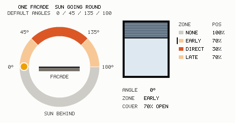

# home-assistant-blueprints

A small collection of Home Assistant automation blueprints.

| Blueprint | File | Description |
| --- | --- | --- |
| IKEA BILRESA scroll wheel (shutter) | [`ikea-bilresa-scroll-wheel-shutter.yaml`](ikea-bilresa-scroll-wheel-shutter.yaml) | Control shutters with the IKEA BILRESA Matter scroll wheel. |
| Sun Azimuth Cover Control | [`sun-azimuth-cover-control.yaml`](sun-azimuth-cover-control.yaml) | Position covers automatically based on where the sun is. |
| Sun Azimuth Cover Control (Seasonal) | [`sun-azimuth-cover-control-seasonal.yaml`](sun-azimuth-cover-control-seasonal.yaml) | As above, with per-season positions, cloud-offset bands, adjustable zone angles and condition overrides. |
| Medicine Intake & Storage Tracker | [`medicine-intake-storage.yaml`](medicine-intake-storage.yaml) | Decrement medicine stock daily and warn before it runs out. |
| Consumable Stock Tracker | [`consumable-stock-tracker.yaml`](consumable-stock-tracker.yaml) | Generic version of the above for any depleting consumable. |
| Accumulation Limit Tracker | [`accumulation-limit-tracker.yaml`](accumulation-limit-tracker.yaml) | Grow a value daily and warn how many days until it hits its max. |
| Sensor-controlled Lights & Switches | [`sensor-triggered-lights.yaml`](sensor-triggered-lights.yaml) | Switch lights/switches from a door/motion sensor's state, with configurable on/off states, on- and off-delays, and a daily time window. |
| Recover state after Unavailable | [`recover-switch-state-after-unavailable.yaml`](recover-switch-state-after-unavailable.yaml) | Force listed devices ON/OFF when they come back from unavailable (e.g. after a power outage). Note: for true "restore previous state", prefer the device's own power-on setting. |
| Battery level monitor & notification | [`battery-level-monitor.yaml`](battery-level-monitor.yaml) | Twice-daily push listing every battery sensor at/below a critical level (default 10%) or unreachable, with each device's area. Auto-monitors all battery sensors except an exclude list. |
| Bulbulator - single-room light cycler | [`bulbulator-single-room-cycler.yaml`](bulbulator-single-room-cycler.yaml) | Cycle a two-switch fixture (1 bulb + 2 bulbs) through 0→1→2→3 bulbs with a single tappable button. No helpers — reads the switches' own state. |
| Bulbulator - input number bulb control | [`bulbulator-input-number-bulb-control.yaml`](bulbulator-input-number-bulb-control.yaml) | Drive the same 1+2 fixture from a 0–3 input_number "brightness" slider (value = bulb count) instead of tap-cycling. |
| Bulbulator - multi-room route light cycler | [`bulbulator-multi-room-route-cycler.yaml`](bulbulator-multi-room-route-cycler.yaml) | Move a single lit light along an ordered route of any length; furthest-on = current point, each tap advances one and turns the rest off, then all-off. No helpers. |
| NFC tag double-tap confirm | [`nfc-double-tap-confirm.yaml`](nfc-double-tap-confirm.yaml) | Run configured actions only after the same NFC tag is tapped twice within a window (default 30 s); guards accidental single taps. Optional first-tap/timeout feedback. |
| Device availability notifier | [`device-availability-notify.yaml`](device-availability-notify.yaml) | Watch up to ~20 devices; on a cron schedule (default daily 09:00) report how many are unavailable past a threshold, to phones (push) and Assist satellites (voice), with optional custom text appended. |

> Dashboard cards for the three Bulbulator blueprints (dynamic `custom:button-card`
> tap buttons + sliders): [`docs/bulbulator-cards.md`](docs/bulbulator-cards.md).
| IKEA BILRESA dual button — toggle switches/lights | [`bilresa-dual-button-switches.yaml`](bilresa-dual-button-switches.yaml) | Toggle up to 6 lights/switches from a BILRESA dual button (single / double / held-and-released per button). Ignores unavailable state entirely. |
| Scheduled & auto-off switch with overrides | [`scheduled-auto-off-switch-with-overrides.yaml`](scheduled-auto-off-switch-with-overrides.yaml) | Drive one switch/light from up to 3 weekly time windows, with an "always on" virtual switch, an "always off" condition, and a manual-on auto-off timeout (deferred to the end of an active window). Uses an `input_datetime` helper so the manual timeout survives the switch going unavailable and HA restarts. |

## Human-made disclaimer

Hi, I'm the human behind this LLM-generated content. I do realize that it may
sometimes be faulty. I only test it on my limited test harness (my home). I tend
to just create something I need, not necessarily well designed for large-scale
HASS deployments. Nevertheless, if you see something may be a base for what
you're doing, feel free to take it. **At your own risk**.

Of course not everything is just LLM hallucinating, ideas are mine. Or I should
say needs are mine, these are the solutions.

With any OSS, feel free to use, be careful, godspede!

## One more human-made disclaimer (srsly? YUP!)

I'm not HASS expert nor AI/LLM expert, I commit and test in my own environment.
Seriously, these are my experiments, maybe one day I will productionize these
blueprints, for now these are my own "hallucinations" ;)

## Disclaimer

These blueprints were generated with the help of a large language model (LLM) and
have not been exhaustively tested. Treat them as a starting point, not a finished
product — read the YAML before you use it, and try it on non-critical devices first.

They control real hardware (covers, switches, and other actuators). Automations
can misfire, move things at the wrong time, or behave unexpectedly if an entity is
unavailable or misconfigured. **Use them entirely at your own risk.**

To the maximum extent permitted by law, the author provides this repository "AS IS",
without warranty of any kind, express or implied, including but not limited to the
warranties of merchantability, fitness for a particular purpose, and
non-infringement. In no event shall the author be liable for any claim, damages, or
other liability — including any damage to property, equipment, or data — arising
from, out of, or in connection with these blueprints or their use.

No license is granted. If you want to reuse or redistribute this beyond personal
use, please ask.

---

## Sun Azimuth Cover Control

Automatically positions four groups of covers (north / south / east / west
facades) based on the sun's **azimuth**, so each facade reacts to whether the
sun is not on it, arriving, shining directly, or leaving.

### How it works

Every facade *faces* a cardinal direction, shifted by the building offset:

| Facade | Faces |
| --- | --- |
| North | `0° + offset` |
| East  | `90° + offset` |
| South | `180° + offset` |
| West  | `270° + offset` |

For each facade the blueprint computes the signed angular difference between
the sun azimuth and the facade direction, normalised to `[-180°, +180°]`, and
picks a zone:

| Condition (`delta = azimuth − facing`) | Zone | Meaning |
| --- | --- | --- |
| `-45° ≤ delta < 45°` | **direct** | Sun shines straight onto the facade |
| `-90° ≤ delta < -45°` | **indirect-early** | Sun just started grazing (rising side) |
| `45° ≤ delta < 90°` | **indirect-late** | Sun about to leave (setting side) |
| otherwise | **none** | Sun is not on the facade |

Each zone maps to a configurable cover position. The full 360° daily sweep is
handled with modular arithmetic, so wrap-around at 0°/360° is correct.

**Worked example** — South facade (`facing = 180°`, offset 0):

- azimuth `90°–135°` → indirect-early
- azimuth `135°–225°` → direct
- azimuth `225°–270°` → indirect-late
- everything else → none

At azimuth `135°` (south-east) the West facade (`delta = -135°`) and North
facade (`delta = 135°`) are both **none** — matching the intuition that the sun
is nowhere near them.

### Position convention

Positions follow the Home Assistant standard: **`100` = fully open, `0` = fully
closed**. Covers must support `cover.set_cover_position`. The example defaults
are `none = 100`, `indirect-early = 70`, `direct = 30`, `indirect-late = 70`
(more sun → more closed). If you prefer to think in "how much closed", just
invert your configured values.

### Schedule, twilight & night fallback

Sun-azimuth positioning is applied while the sun is **above the horizon** (read
from the elevation entity) **and** inside the active window. The active window
is one of two modes:

- **Time window** (default) — `Allowed from` … `Allowed until` (may cross
  midnight).
- **Sunrise/sunset** — enable *"Use sunrise/sunset instead of the time window"*
  and the fixed times are ignored; the active window becomes exactly
  sunrise-to-sunset (elevation > 0). Morning/evening positions are unused in
  this mode.

In **time-window mode**, while inside the window but the sun is still below the
horizon, all covers take a transitional position:

- between the **start time and sunrise** → **Morning position**
- between **sunset and the end time** → **Evening position**

(Morning vs evening is decided by the window's midpoint, which also works for
windows that cross midnight.)

**Outside the active window** (and outside sunrise-sunset in sun mode):

- **Close fully at night = on** → every configured cover is driven to the
  **Night position** (default `0`, fully closed).
- **Close fully at night = off** → covers are left untouched and keep whatever
  position they had.

If the elevation entity is unavailable/non-numeric, the automation does nothing
that run. A cover is only ever commanded when its current position differs from
the target, avoiding needless motor movement.

### Cloud coverage (optional)

Provide a **Cloud coverage entity** (numeric, 0–100 %) and a **Cloudy above**
threshold, and every phase — **except the night close** — gains a separate
"– cloudy" position:

- When cloud coverage is **strictly above** the threshold → the `– cloudy`
  variant is used (`None – cloudy`, `Direct – cloudy`, `Morning – cloudy`, …).
- Otherwise, or when no cloud entity is configured, the clear-sky positions are
  used.

Because there's no direct light on an overcast day, the cloudy defaults are more
open than their clear-sky counterparts (e.g. `Direct` `30` → `Direct – cloudy`
`70`). Cloud changes are applied on the regular 5-minute re-evaluation.

### Disable / guard

An optional guard can stop the automation **completely** (no sun positioning
and no night close). Two independent inputs are provided; if either one
triggers, the run is halted:

- **Disable entity** — pick a single boolean-like entity (`input_boolean`,
  `binary_sensor`, `switch`). While its state is `on`, the automation does
  nothing. Ideal for a simple "out of home" helper.
- **Disable when (advanced)** — a full condition builder. If **any** condition
  you add here is true, the automation stops. To express *"out of home OR
  vacation"*, add two state conditions (one per helper) — each is checked
  independently, so either being `on` halts the run. For more complex logic,
  nest an `and`/`or`/`not` block inside.

Both are optional; leaving them empty disables the guard.

### Re-evaluation

The automation re-runs on:

- any change of the azimuth entity,
- every 5 minutes (`time_pattern`),
- the window start and end times,
- Home Assistant startup.

It runs in `mode: queued` so bursts of azimuth updates are handled in order.

### Inputs

| Input | Notes |
| --- | --- |
| **Sun azimuth entity** | A `sensor`/`input_number` whose **state** is the azimuth in degrees (0–360). For the built-in Sun integration use `sensor.sun_solar_azimuth` — the `sun.sun` entity exposes azimuth only as an *attribute* and cannot be used directly. |
| **Sun elevation entity** | A `sensor`/`input_number` whose **state** is the elevation in degrees (positive = above horizon). Use `sensor.sun_solar_elevation`. |
| **Building offset** | `-45°`…`+45°`, rotation of the building away from true N-S / E-W. |
| **North / East / South / West covers** | Cover groups (each optional). |
| **None / Indirect-early / Direct / Indirect-late** | Clear-sky target position (0–100%) per zone. |
| **… – cloudy** (per zone + morning/evening) | Position used when cloud coverage is above the threshold. |
| **Cloud coverage entity** | Optional numeric `sensor`/`input_number` (0–100%). Empty = always clear-sky. |
| **Cloudy above** | Coverage strictly above this % counts as cloudy. |
| **Use sunrise/sunset instead of the time window** | Ignore the fixed times; active window becomes sunrise→sunset. |
| **Allowed from / until** | Fixed schedule window (may cross midnight); ignored in sunrise/sunset mode. |
| **Morning position** | All-cover position between start time and sunrise (time-window mode). |
| **Evening position** | All-cover position between sunset and end time (time-window mode). |
| **Close fully at night** | Toggle for the night fallback. |
| **Night position** | Position used outside the window when the fallback is on. |
| **Disable entity** | Optional boolean-like entity; while `on` the automation is stopped. |
| **Disable when (advanced)** | Optional condition(s); if any is true the automation is stopped. |

### Requirements

- Numeric azimuth **and** elevation sources. With the built-in **Sun**
  integration, enable the `sensor.sun_solar_azimuth` and
  `sensor.sun_solar_elevation` entities (Settings → Devices & Services →
  Entities).
- Covers that support `set_cover_position`.

### Installation

1. In Home Assistant: **Settings → Automations & Scenes → Blueprints →
   Import Blueprint**.
2. Paste the raw URL of `sun-azimuth-cover-control.yaml` (or copy the file into
   `config/blueprints/automation/<your-folder>/`).
3. Create an automation from the blueprint and fill in the inputs.

---

## Sun Azimuth Cover Control (Seasonal)

A variant of the sun-azimuth blueprint. Same core geometry (facade → zone from
azimuth), with season-specific positions, cloud offsets, and condition
overrides. Use this instead of the base blueprint when you want the sun-zone
positions to change with the season.

### What's different from the base blueprint

**1. Per-season positions (16 values).** The four zone positions
(`none` / `indirect-early` / `direct` / `indirect-late`) are configured per
**season** — 4 seasons × 4 zones = 16 sliders, in 4 collapsed sections
(`Positions · Spring`, `Positions · Summer`, …). The values are shared by all
sides. A **Season entity** (state `spring`/`summer`/`autumn`/`fall`/`winter`)
selects which season's set is used; empty or unrecognised falls back to
`summer`.

**2. Cloud coverage as offset bands (not per-side values).** Instead of a single
"cloudy" position per side, three thresholds — **slightly cloudy**, **cloudy**,
**heavily cloudy** — split coverage into four bands, and each band adds an
**opening offset** (0–100) to the base position:

| Cloud coverage | Offset applied |
| --- | --- |
| `0 …` slightly cloudy | Offset 1 (default `0`) |
| slightly … cloudy | Offset 2 (default `15`) |
| cloudy … heavily cloudy | Offset 3 (default `30`) |
| heavily cloudy `… 100` | Offset 4 (default `45`) |

`final = clamp(base + offset, 0, 100)`. The offset applies to the **sun phase
only** — the morning (before sunrise), evening (after sunset) and night positions
are used as-is, unaffected by cloud coverage. No cloud entity (or a non-numeric
one) → offset `0`.

**3. Three condition overrides** (replacing the old disable entity / disable
condition). Each is a full condition builder, evaluated **before** the normal
logic, in this precedence:

1. **Pause if…** — any condition true → the automation makes **no changes at
   all** (covers stay where they are; further changes are effectively paused
   while the condition holds).
2. **Always open if…** — any condition true → all covers forced to **100 %**.
3. **Always closed if…** — any condition true → all covers forced to **0 %**.
4. otherwise → normal per-side/season + cloud logic.

(To change the precedence, reorder the options in the `choose:` block.)

**3b. Per-cover manual override (pin).** Any single cover can be pinned to a
fixed position via its own `input_number` helper, named by convention: for
`cover.<name>` the helper is `input_number.<name><suffix>` (suffix configurable,
default `_override`). Only covers you want to pin need a helper; give each a
range from any negative minimum (e.g. `-1`) up to `100`.

- helper at **0..100** → that cover is **held** at that position (`0` = closed,
  `100` = open), overriding the sun/season logic **and** "always open" / "always
  closed" for that cover.
- helper **negative** (or missing / non-numeric) → no pin; the cover follows the
  normal automation.

The pin wins per-cover inside every non-pause branch (so the other covers still
obey open/closed/normal), but **"pause" still stops everything**. Pins are
enforced on every run, so a pinned cover snaps back if moved by hand; changes
apply within ~5 min or on the next sun movement. Tip: name the helper
"`<Cover name> Override`" and HA slugifies it to match the default suffix.

**4. Adjustable zone angles (Advanced section).** The base blueprint hardcodes
where one zone ends and the next begins. Here the four boundaries are sliders.

The sun angle is measured per facade as the sun's **progress across that
facade**: `0°` = sun 90° before it, `90°` = straight on it, `180°` = 90° past
it. Above `180°` the sun is behind the facade and `none` always applies.



One facade, one full turn of the sun, at the default angles and the default
spring positions. Band colour is **sun intensity on the facade** — `early` and
`late` share a colour because they are the same intensity (and, by default, the
same position); the labels tell them apart.

```
  A:    0    T1        T2         T3       T4    180
        |-----|---------|----------|--------|-----|
         none   EARLY      DIRECT     LATE   none
```

| Threshold | Default | Meaning |
| --- | --- | --- |
| **Early starts at** | `0` | Below it → `none`. Raise to make the sun wait longer before the early band starts. |
| **Direct starts at** | `45` | Early ends, direct begins. |
| **Late starts at** | `135` | Direct ends, late begins. |
| **Late ends at** | `180` | Above it → `none` again, until the next cycle's early band. Lower to end the late band sooner. |

The defaults reproduce the base blueprint exactly (early 45° wide, direct 90°,
late 45°). The thresholds are evaluated in order, so keep them ascending —
`Late ends at` below `Late starts at` just truncates the bands beneath it.

### Notes

- Morning/evening/night positions remain **global single values** (not
  per-season); the cloud offset applies to the sun phase only — morning, evening
  and night are never offset.
- Everything else — elevation-driven day/night, time-window vs sunrise/sunset,
  the 5-minute re-evaluation, "only move if the position changed" — behaves like
  the base blueprint.
- If you don't need season granularity at all, the base
  [`sun-azimuth-cover-control.yaml`](sun-azimuth-cover-control.yaml) is simpler.

---

## Medicine Intake & Storage Tracker

Keeps a running count of your medicine stock and pushes a notification before
any medicine runs out.

### How it works

Each medicine is a **pair of number helpers** (`input_number`):

- **Storage** — current units in stock.
- **Daily intake** — units taken per day.

Up to **10 medicines** can be configured; each has its own optional name plus
the storage/intake pair. Slots whose storage helper is left empty are ignored,
so use as many as you need.

Once a day, at the configured **Daily time**, the automation:

1. Decrements every storage helper by its daily intake (never below `0`).
2. Computes remaining supply as `storage ÷ daily intake` (in days).
3. Collects every medicine with **fewer than "Warn this many days early"**
   days of supply left into a summary.
4. If the summary is non-empty, sends it as a notification to every configured
   device (companion app). Nothing is sent when everything is well-stocked.

The summary lists each low medicine, e.g.:

```
💊 Medicine running low
• Vitamin D: 4 left (~4.0 day(s), 1/day)
• Magnesium: 3 left (~1.0 day(s), 3/day)
```

### Notes

- **Fixed slots, not "unlimited".** Home Assistant blueprints can't add input
  groups dynamically, so 10 named slots are provided. Using named slots (rather
  than two index-paired entity lists) keeps each storage paired with the right
  intake — important for medicine.
- A medicine with a daily intake of `0` is never reported as running low.
- Setting **Warn days** to `0` disables early warnings (you'd only ever be told
  once a medicine is already at/над its last day).
- Decrementing happens **only** on the daily time trigger — there is no
  Home Assistant-start trigger, so restarts do not double-count.
- Notifications are sent via the `notify.mobile_app_<device>` service, derived
  from each selected device's **original** name (`notify.mobile_app_` +
  slugified device name). This is how the companion app registers the service,
  and it keeps working even if you rename the device in Home Assistant. If a
  device was renamed *inside the companion app itself*, re-select it after the
  service name updates.

### Inputs

| Input | Notes |
| --- | --- |
| **Daily time** | When stock is decremented and notifications are sent. |
| **Warn this many days early** | Threshold in days (0–30) for the low-supply warning. |
| **Notification targets** | One or more companion-app devices to notify. |
| **Notification title** | Title of the push notification. |
| **Medicine N: name / storage helper / daily intake helper** | Per-medicine label and the two `input_number` helpers (10 slots). |

### Requirements

- Two `input_number` helpers per medicine (one for stock, one for daily intake).
- At least one mobile device running the Home Assistant companion app.

---

## Consumable Stock Tracker

A generic version of the medicine tracker for **any depleting consumable**
(coffee, water filters, pet food, printer paper, …). Same mechanics, neutral
wording.

Each item is a pair of `input_number` helpers — **Stock** (amount on hand) and
**Daily use** (units consumed per day). Once a day it decrements stock by daily
use (clamped at `0`), computes `stock ÷ daily use` days of supply, and pushes a
summary of every item with fewer than the **Warn threshold (days)** left to the
selected devices. Up to 10 items; empty slots ignored.

A **Pause if…** condition (full condition builder) skips the whole run when any
of its conditions is true — no counts are changed and no notification is sent —
just like the "pause" override in the seasonal cover blueprint. Leave it empty
to never pause.

Everything else — daily-only trigger (no double-count on restart), the
`notify.mobile_app_<device>` delivery, intake-`0` never flagged, warn-`0`
disables early warnings — behaves exactly like the medicine tracker.

---

## Accumulation Limit Tracker

The **inverse** of the stock trackers: for values that **grow over time** and
you want warning before they reach a ceiling (a savings goal, accumulated
hours, a filling tank, a counter approaching a cap, …).

Each item is a pair of `input_number` helpers — **Value** (current value) and
**Daily increase** (growth per day). The ceiling is the **Value helper's own
`max` setting**, so no separate limit input is needed — just set the max on each
Value helper.

Once a day it:

1. Increases each value by its daily increase (clamped at the helper's `max`).
2. Computes days until the limit: `(max − value) ÷ daily increase`.
3. Pushes a summary of every item that will hit its max within the **Warn
   threshold (days)** to the selected devices, e.g.:

```
📈 Approaching limit
• Savings: 920/1000 (~4.0 day(s) to max, +20/day)
• Hours: 96/100 (~2.0 day(s) to max, +2/day)
```

A daily increase of `0` (never grows) is never flagged, and an item already at
its max reports `~0 day(s)`. Same delivery and trigger behaviour as the other
trackers, including the **Pause if…** condition that skips a run entirely when
true.
